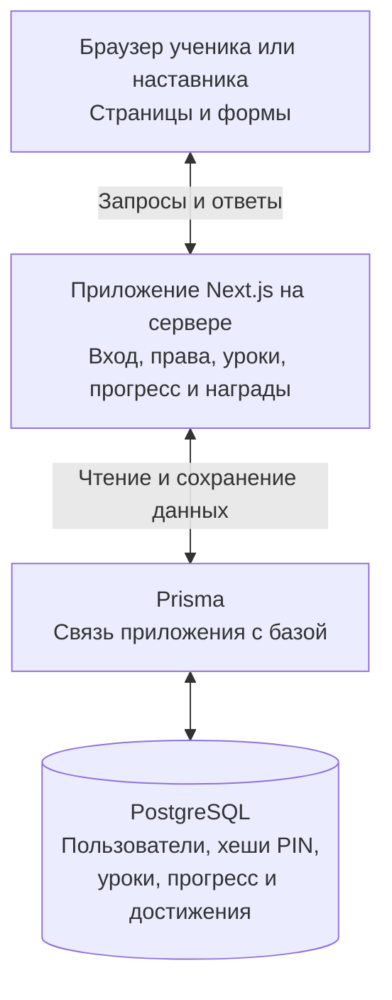
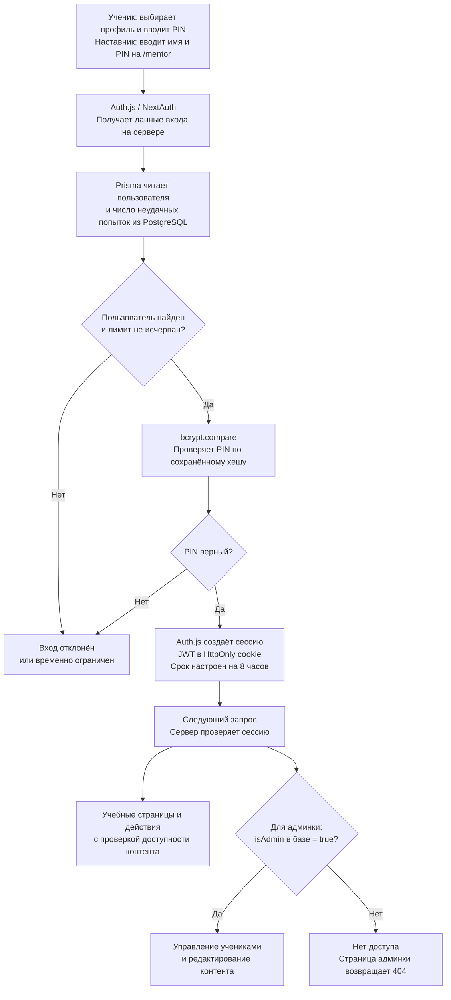
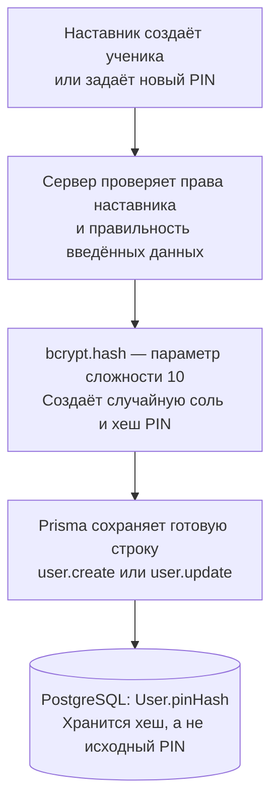

# Как работает приложение Кванториума
Проверено по исходному коду 10 сентября 2026 года. Схема описывает реализацию проекта, а не проверку работающего сервера.

## Общая схема

Vercel размещает и запускает приложение. Supabase предоставляет PostgreSQL и может хранить загруженные изображения. При переезде приложение и PostgreSQL можно разместить на Debian. Авторизация в этом проекте реализована через Auth.js / NextAuth, а не Supabase Auth. Браузер не подключается к PostgreSQL напрямую.

## Вход и права доступа

При пяти неудачных попытках за последние пять минут для одного пользователя дальнейшая попытка отклоняется, пока число ошибок в этом окне не уменьшится. Код пытается записать результат проверки PIN в LoginAttempt; при ошибке записи сам вход не прерывается. Это описание существующего ограничения, не гарантия полной защиты от перебора.

Открытие защищённой страницы без сессии возвращает на вход. Серверные действия отдельно проверяют сессию; административные действия дополнительно читают isAdmin из базы. Отказ административному действию — FORBIDDEN, странице — 404. Скрытый адрес /mentor сам по себе не является защитой.

## Создание или смена PIN

**Prisma не хеширует пароль.** Она работает с базой: записывает готовый хеш и получает его для проверки. Хеширование и сравнение выполняет bcryptjs на сервере приложения.

Соль — случайная добавка, создаваемая при хешировании. Она и параметр сложности входят в сохранённую строку bcrypt. Поэтому одинаковые PIN могут иметь разные хеши. При входе bcrypt.compare использует параметры из сохранённой строки и проверяет введённый PIN. Расшифровки нет: забытый PIN заменяют новым. Хеш не делает короткий PIN невозможным для подбора.

JWT — подтверждение выполненного входа, а не сохранённый PIN. Auth.js хранит его в HttpOnly cookie, недоступной обычному JavaScript страницы; установленная библиотека по умолчанию шифрует JWT с использованием AUTH_SECRET. PIN повторно не проверяется при каждом открытии страницы.

## Какие файлы за что отвечают
- src/auth.ts — поиск пользователя, ограничение попыток, bcrypt.compare и настройка JWT-сессии.
- src/auth.config.ts — перенос ID в сессию и возврат неавторизованного посетителя на вход.
- src/proxy.ts — подключение проверки сессии для страниц и заголовки безопасности.
- src/lib/server-guard.ts — проверки requireUser, requireAdmin и requireAdminOr404.
- src/lib/actions/student-profile.ts — создание ученика, смена PIN, bcrypt.hash и сохранение через Prisma.
- src/lib/db.ts — подключение Prisma к PostgreSQL через DATABASE_URL и адаптер PrismaPg.
- prisma/schema.prisma — описание таблиц, включая User.pinHash и User.isAdmin.

## При переносе на Debian
Переносятся исходники приложения и база с существующими User.pinHash. Повторно хешировать эти значения нельзя: они уже являются хешами. Сохраняются и связи пользователей с прогрессом. Настраиваются подключение к новой базе, HTTPS и AUTH_SECRET. При смене секрета старые сессии перестанут читаться — пользователи войдут заново с прежними PIN. Переносить открытые PIN для этого не требуется.
